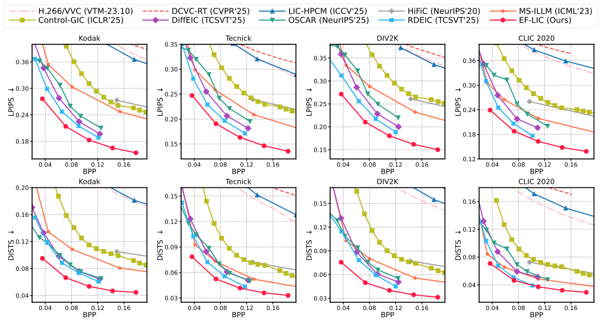

# EF-LIC: Efficient Learned Image Compression without Entropy Coding

Official inference code for **EF-LIC**, a multi-rate learned image compression model without entropy coding.

**Paper:** 

## Repository layout

```text
.
├── EF_LIC.py                  # inference-only EF-LIC model
├── test.py                    # Kodak/test-folder evaluation script
├── requirements.txt
├── ckpt/
│   └── checkpoint.pth.tar     # inference checkpoint
└── kodak/
    ├── kodim01.png
    └── ...
```

## Environment

Python 3.12 is recommended. PyTorch should be newer than 2.0.

```bash
conda create -n $your_env_name$ python=3.12 -y
conda activate $your_env_name$
pip install torch torchvision
pip install -r requirements.txt
```

The evaluation uses:

- `lpips` for LPIPS with VGG features.
- `dists-pytorch` for DISTS.
- `Pillow` and `torchvision` for image loading and tensor conversion.

## Checkpoint

Put the inference checkpoint at:

```text
ckpt/checkpoint.pth.tar
```

## Pretrained Checkpoints

You can download the pretrained inference checkpoint for **EF-LIC** from the following link:

* **[Download checkpoint.pth.tar]([YOUR_DOWNLOAD_LINK_HERE](https://drive.google.com/file/d/1XrfmdUx0nFFBg9_ToVzz-A2jFZ5qiGR6/view?usp=sharing))**

## Test on Kodak

Default paths:

```bash
python test.py
```

Equivalent explicit command:

```bash
python test.py \
  --kodak-dir kodak \
  --ckpt-path ckpt/checkpoint.pth.tar
```

The script evaluates five rate points, `force_ind = 0, 1, 2, 3, 4`. For each image, it prints the latencies and quality metrics in the following format:

```text
Enc (ms) | Dec (ms) | PSNR | LPIPS | DISTS | BPP
```

After each rate point, it prints the average result over the image folder.

## Performance & Rate-Distortion Curves

<p align="center">
  
</p>


## Speed & Engineering Optimizations

This repository incorporates several engineering optimizations. As a result, the execution speed on the Kodak dataset outperforms the original baseline numbers reported in the paper.

### Macro Speed Comparison (ms)

The table below compares the macro average latency per image on the Kodak dataset between the paper's original implementation and this optimized codebase:

| Stage | Paper (Baseline) | This Repo (Optimized Avg) |
| :--- | :---: | :---: |
| **Encoding (Compress)** | 17.62 ms | 13.04 ms |
| **Decoding (Decompress)** | 13.72 ms | 11.52 ms |

> 📌 *Note: This Repo's data shows the overall average calculated across all 5 rate points (`force_ind = 0, 1, 2, 3, 4`).*

### Detailed Latency Breakdown by Rate Point

For more granular benchmarking, here is the average latency of this repository at each specific quality level:

| `force_ind` | Encoding (Compress) | Decoding (Decompress) |
| :---: | :---: | :---: |
| **0** | 10.59 ms | 11.30 ms |
| **1** | 11.73 ms | 11.39 ms |
| **2** | 13.23 ms | 11.69 ms |
| **3** | 13.70 ms | 11.53 ms |
| **4** | 15.76 ms | 11.69 ms |

## Citation

```bibtex
@inproceedings{eflic2026,
  title     = {Efficient Learned Image Compression without Entropy Coding},
  booktitle = {International Conference on Machine Learning},
  year      = {2026}
}
```
